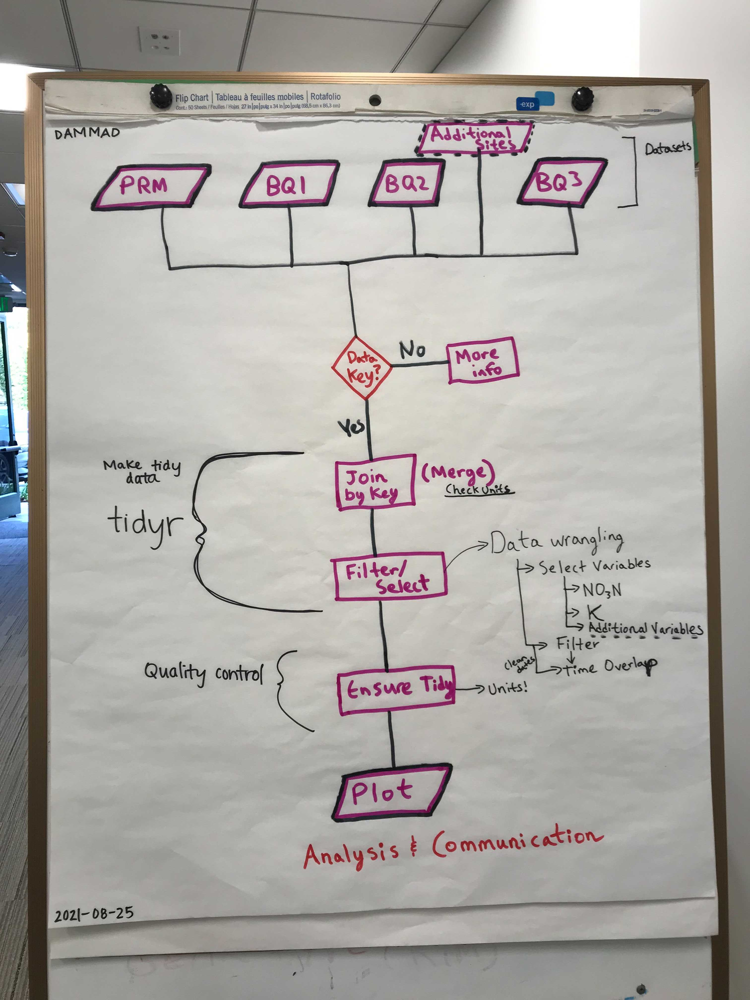
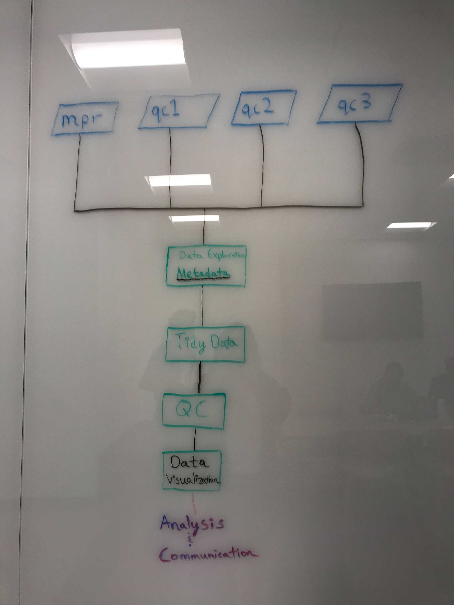

Contact: mforsline@bren.ucsb.edu, asy@bren.ucsb.edu, desik@bren.ucsb.edu


# Background Information & Objective
Stream water data collected weekly from 1988 to 2012 at Luquillo Mountain in Puerto Rico, including data after Hurricane Hugo in September 1989. This data includes potassium concentration (milligrams per liter) and nitrate (micrograms per liter) concentration from four different sites.

Our research focuses on comparing K and NO3 concentrations at the different sites before and after Hurricane Hugo in September 1989.


# Collaborative workflow

The raw data is stored on our shared server at Bren (Taylor). Our project repository is git-controlled on github, which we can access through our personal accounts on the Taylor server.


### Initial approach



### Final approach



## Git workflow

Alex Vand created the github repository. Desik Somasundaram and Mia Forsline cloned the repo and made changes on their virtual machine account and then pushed changes back to the github repo.


## Pair programming

Our group used the pair programming approach with one driver and two navigators. The navigators searched online to support the driver and also examined the metadata to ensure consistency and accuracy among the different datasets.

## Challenges

One of key challenges was establishing the initial Github workflow among team members.
We had issues regarding push/pull permissions and Personal Access Tokens on the remote server that had to resolved before proceeding with our coding. 

We also had some issues with the remote server lagging which required killing active R sessions and restarting.

The collaborative workflow was a new experience for our team so we had to get acquainted with everyone's pace and learn to speak in technical language that is easy to understand for everyone in the group, especially during pair programming.


# Code

## Attach required packages
```{r setup, message = FALSE}
knitr::opts_chunk$set(echo = TRUE, message = FALSE, warning = FALSE)
library(tidyverse)
library(here)
library(janitor)
library(ggplot2)
library(patchwork)

```


## Read in the data, identifying unique NA values
```{r}
qc1 <- read_csv("/courses/EDS214/eds214-dammad-coders/data/raw_data/QuebradaCuenca1-Bisley.csv", na = c("-9999", "-9999.00", "-9999.0")) %>% 
  clean_names()

qc2 <- read_csv("/courses/EDS214/eds214-dammad-coders/data/raw_data/QuebradaCuenca2-Bisley.csv", na = c("-9999", "-9999.00", "-9999.0")) %>% 
  clean_names()

qc3 <- read_csv("/courses/EDS214/eds214-dammad-coders/data/raw_data/QuebradaCuenca3-Bisley.csv", na = c("-9999", "-9999.00", "-9999.0")) %>% 
  clean_names()

mpr <- read_csv("/courses/EDS214/eds214-dammad-coders/data/raw_data/RioMameyesPuenteRoto.csv", na = c("-9999", "-9999.00", "-9999.0")) %>% 
  clean_names()
```


## Clean/wrangle the data
- Select variables (columns) of interest
- Converted the date to ISO 8601 format
- Renamed columns to include units
- Combined all four datasets

```{r}
qc1_clean <- qc1 %>% 
  select(sample_id, code, sample_date, k, no3) %>% 
  mutate(sample_date = lubridate::mdy(sample_date)) %>% 
  rename(k_mg_L = k, no3_ug_L = no3)

qc2_clean <- qc2 %>% 
  select(sample_id, code, sample_date, k, no3) %>% 
  mutate(sample_date = lubridate::mdy_hm(sample_date)) %>% 
  rename(k_mg_L = k, no3_ug_L = no3)

qc3_clean <- qc3 %>% 
  select(sample_id, code, sample_date, k, no3) %>% 
  mutate(sample_date = lubridate::mdy(sample_date)) %>% 
  rename(k_mg_L = k, no3_ug_L = no3)

mpr_clean <- mpr %>% 
  select(sample_id, code, sample_date, k, no3) %>% 
  mutate(sample_date = lubridate::mdy(sample_date)) %>% 
  rename(k_mg_L = k, no3_ug_L = no3)


combined_sites <- rbind(qc1_clean, qc2_clean, qc3_clean, mpr_clean) %>% 
  rename(site_id = sample_id) %>%
  mutate(year = lubridate::year(sample_date))
  
  
combined_summary <- combined_sites %>% 
  group_by(site_id, year) %>% 
  summarize(mean_k = mean(k_mg_L, na.rm = TRUE),
            mean_no3 = mean(no3_ug_L, na.rm = TRUE))
```

## Plotting the data
- Created one plot for K and another for NO3
- Created an aggregated graph using the `patchwork` package!
```{r}
k <- ggplot(data = combined_sites, aes(x = sample_date, y = k_mg_L))+
  geom_line(aes(color = site_id),
            show.legend = FALSE)+
  theme_classic()+
  theme(axis.title.x = element_blank())+
  labs(y = "K (mg/L)",
       color = "Sites",
       title = "Potassium and nitrate concentrations for stream water in Luquillo Mountain")

n <- ggplot(data = combined_sites, aes(x = sample_date, y = no3_ug_L))+
  geom_line(aes(color = site_id)) +
  theme_classic()+
  labs(x = "Year",
       y = expression(paste(NO[3]-N, " ",(mu *g/L))),
       color = "Sites") 

k / n
```


## Summary Plot

```{r}
k_summary_plot <- ggplot(data = combined_summary, aes(x = year,
                                                      y = mean_k)) +
  geom_point(aes(color = site_id, shape = site_id)) +
  geom_line(aes(color = site_id)) +
  theme_classic() +
  theme(axis.title.x = element_blank(),
        legend.position = "none",
        plot.title = element_text(hjust = 0.5)) +
  labs(y = "K (mg/L)",
       color = "Sites",
       title = "Potassium and nitrate annual mean concentrations \n for stream water in Luquillo Mountain")

n_summary_plot <- ggplot(data = combined_summary, aes(x = year,
                                                      y = mean_no3,
                                                      shape = site_id,
                                                      color = site_id)) +
  geom_point() +
  geom_line() +
  theme_classic() +
  labs(x = "Year",
       y = expression(paste(NO[3]-N, " ",(mu *g/L))),
       color = "Sites",
       shape = "Sites")

k_summary_plot / n_summary_plot
```


## Results & Analysis

Streamwater chemistry variance appears to be correlated with external factors, such as extreme weather events. We see a spike in potassium and nitrate concentrations at all four sites around 1990, coinciding with Hurricane Hugo, which occurred in September 1989. There is another distinct peak in nitrate concentration (specifically at MPR) around 1998, which corresponds with Hurricane Georges.

Nitrate concentration data was not consistently collected from July 1994 to October 1996.


## Further Research

We are interested to determine the statistical significance of our findings and to further explore hypotheses for the high potassium concentration and low nitrate concentration around 1993. Furthermore, would like to expand this research with the most current data.


